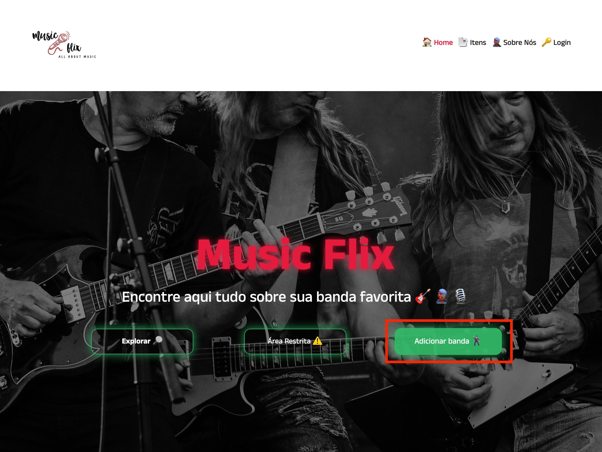
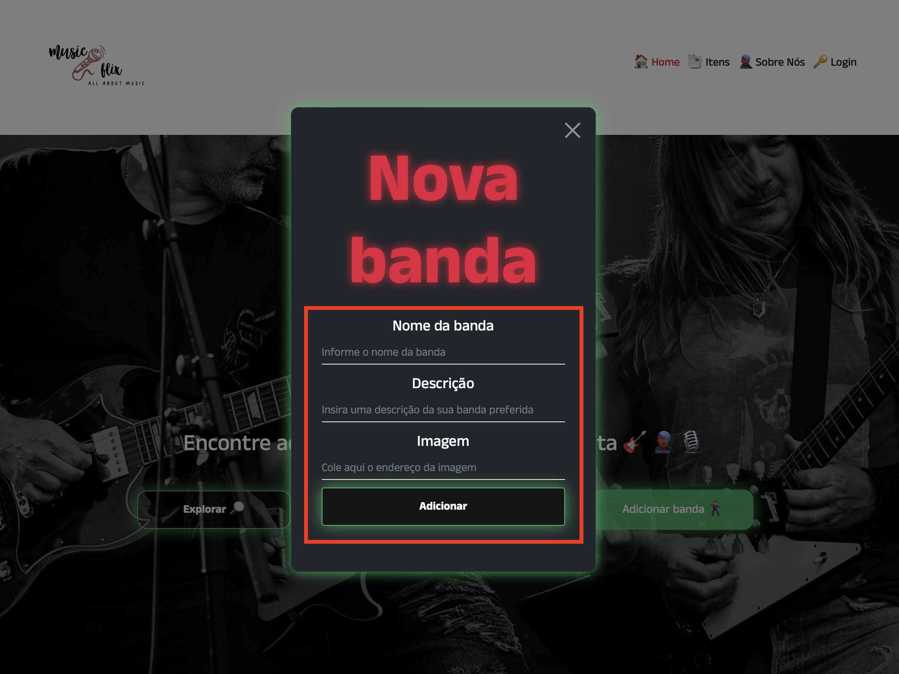
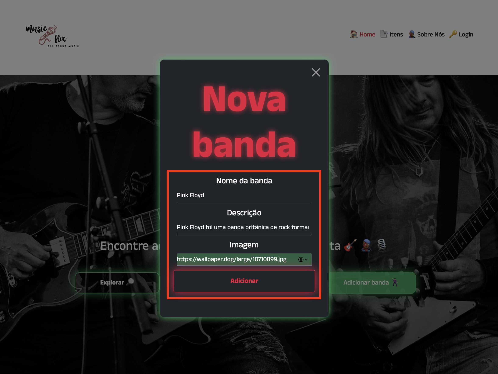
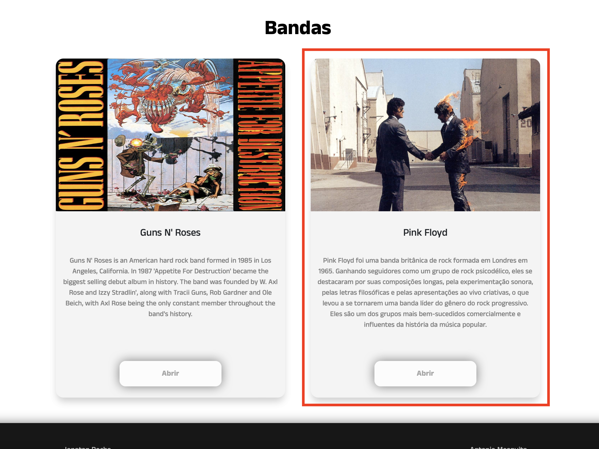

# Frontend 2 - Checkpoint 1

1. Na imagem abaixo podemos ver marcado o botão “adicionar banda” ao clicarmos entra em ação um modal 
    
    
    
    
    
2. Essa janela é para inserirmos os dados referentes à banda que escolhermos adicionar.
    
    
    
    
    
3. Na imagem abaixo podemos observar que o card da banda foi criado com sucesso contendo todos os dados que inserimos anteriormente.

    
